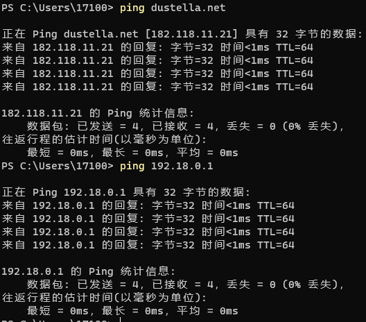

# 网络-UDP

## 1.1 网络通信概述

#### 1. 网络是什么

* 网络是一种辅助双方或者多方能够连接在一起的工具

#### 2. 使用网络的目的

* 实现多台主机之间的通讯与数据交互

#### 3. 网络编程

* 使在不同电脑上的软件能够进行数据传递，即进程上的通信
* 以爬虫为例，我们需要向网站发送**请求**，这种请求的动作就可以被称作网络

## 1.2 IP地址

#### 1. 什么是IP地址

* 用于标记计算机在的网络中的位置

#### 2.获取IP的指令

在终端中输入以下指令：

##### * 查看或配置网卡信息 ipconfig(Windows) / ifconfig(Linux)

将获取很多ip地址，可根据电脑的**网络连接方式**（无线(无线局域网适配器)/有线(以太网适配器)/虚拟机(VMxx)/代理）来辨别主机真实的网络地址。

一般将**IPv4地址**称为地址。192.168打头的一般为局域网。


##### * 测试远程主机连通性 ping

通常用 ```ping + 域名或IP地址``` 来检测网络是否正常：



## 1.3 端口
